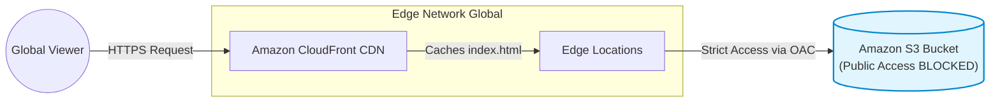

# 🌍 Secure Global Content Delivery (Cloud Portfolio)

**🔥 LIVE PROJECT LINK:** [Click Here to View Live Portfolio](https://d3d8644plxm6nc.cloudfront.net)

Welcome to the **Storage & Content Delivery** section of my Cloud Portfolio! 

Hosting a website on a single server (like EC2) is old school and expensive. In this project, I deployed a fully functional, highly available static web application without provisioning a single server. It is globally distributed, fast, and highly secure.

---

## 🏗️ Architecture Diagram

This diagram shows how a user's request travels securely through the CDN to fetch the website files from an isolated storage bucket.

Infrastructure Components Built (Step-by-Step)
To achieve enterprise-grade security and speed, I configured:

- Amazon S3 (Simple Storage Service): Created a standard bucket to store the index.html web files.

- Zero Public Access: Explicitly enabled "Block all public access" on the S3 bucket to prevent any direct, unauthorized internet access to the raw files.

- Amazon CloudFront (CDN): Provisioned a global distribution to cache the website content at AWS Edge Locations worldwide, drastically reducing latency for end-users.

- HTTPS Encryption: Enforced a Redirect HTTP to HTTPS viewer protocol policy to ensure all data in transit is encrypted.

- Origin Access Control (OAC): Configured strict S3 Bucket Policies using OAC, granting read-only permission exclusively to the CloudFront distribution.

- Cache Invalidation: Successfully managed zero-downtime website updates by running CloudFront Invalidations (/*) to push new content to edge nodes.
