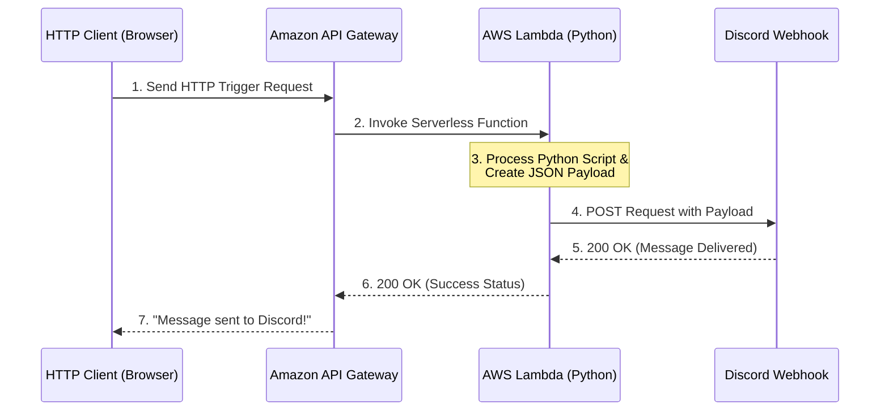

# 🤖 Event-Driven Serverless Notification Bot

Welcome to the **Serverless Automation** section of my Cloud Portfolio! ⚡

In modern cloud computing, managing servers for simple background tasks is inefficient. In this project, I built a completely serverless event-driven architecture that automatically triggers a Python script via an API endpoint to send real-time notifications to a third-party platform (Discord).

---

## 🏗️ Architecture Diagram

This sequence diagram outlines the entire flow of the HTTP request from the user's browser to the final Discord webhook delivery.

