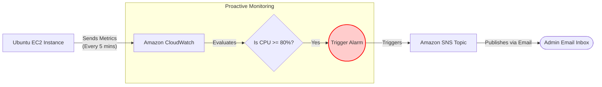

# 📈 Automated Server Monitoring & Alerting System

Welcome to the **Monitoring & Incident Response** section of my Cloud Portfolio! ☁️🔔

Building a server is only half the job; ensuring it stays healthy is where the real engineering happens. In this project, I implemented a proactive monitoring pipeline that automatically detects high resource usage and alerts the administrator before any system failure occurs.

---

## 🏗️ Architecture Diagram

This diagram illustrates the automated flow from resource consumption to real-time notification.

- *"Configured SNS to send email when EC2 CPU crosses 80%."*
