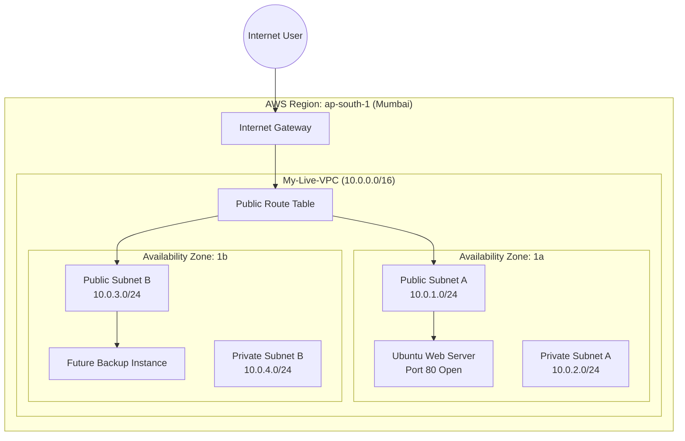

# 🌐 Highly Available Custom VPC Architecture

Welcome to the **Networking & Infrastructure** section of my Cloud Portfolio! ☁️

In this project, I moved beyond standard default settings and engineered a highly available **Virtual Private Cloud (VPC)** from scratch on AWS. This architecture ensures that even if one data center (Availability Zone) goes offline, the application can remain operational.

---

## 🏗️ Architecture Diagram

Below is the visual representation of the network topology I built. It demonstrates the logical separation of public and private subnets across multiple Availability Zones.

  ## 🛠️ Infrastructure Components Built (Step-by-Step):
* **Custom VPC:** Created a logically isolated virtual network with a custom IPv4 CIDR block (10.0.0.0/16).
* **Subnetting (High Availability):** Provisioned 2 Public and 2 Private subnets distributed across two different Availability Zones (ap-south-1a & ap-south-1b) to ensure fault tolerance.
* **Internet Gateway (IGW):** Attached an IGW to the VPC to enable internet access for public-facing instances.
* **Route Tables:** Configured custom public route tables directing `0.0.0.0/0` traffic to the IGW, while keeping private subnets completely isolated.
* **EC2 Instance:** Launched an Ubuntu Web Server in the public subnet with an auto-assigned public IP.
* **Security Groups:** Implemented strict inbound firewall rules (Port 80 for HTTP, Port 22 for SSH) to secure the server from unauthorized access.
